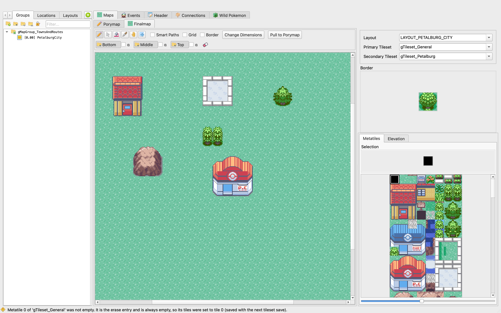

.. _porytiles-ref:

********************************
The Porymap / Porytiles Workflow
********************************

.. note::
    This page describes a feature of this **fork** of Porymap, not of upstream Porymap. It only appears for a
    project with ``Project Settings > Layout/Metatiles > Enable triple layer metatiles`` checked; see
    `On/off switch`_ below.

Normally you build a map out of **metatiles**: every combination you want to place (a house on grass, a tree on
sand) has to exist as its own metatile first, so you spend a lot of time in the Tileset Editor assembling parts
before you can draw anything. This fork adds a second way to work: you paint the map directly, on three layers, with
small single-layer pieces called **porytiles**, and the tool generates the real metatiles for you.

    The "Maps" tab has two sub-tabs: **Porymap** (the 3-layer design view) and **Finalmap** (the real, generated map —
    what used to simply be "Map").

Concepts
========

Porytile
    A single-layer, 2x2-tile building block, similar to a metatile but for exactly one of the three layers. Lives in
    ``porytiles.json`` next to a tileset's ``metatiles.bin``. Porytile 0 (like metatile 0) is an ordinary entry —
    paint it, give it a behavior or a label, just like any other id.

Porymap view
    The design surface where you paint porytiles onto three layers — **Bottom**, **Middle**, **Top** — of a layout.
    Independent of the real map until you explicitly transfer it. Every edit is saved immediately (like a document
    autosave) to ``data/layers/<layout>/layers.json``; it has its own Undo history.

Finalmap
    What the map actually is in the game: metatiles and ``map.bin``. This is the original Porymap map view, renamed
    in this fork to distinguish it from the Porymap view above. Editing it directly works exactly as it always did.

Write to Finalmap
    Turns the current Porymap view into real metatiles: matching combinations of the three layers are deduplicated
    into one metatile, existing metatiles are reused, empty slots are filled, and the tileset **grows itself** as
    needed (primary tileset first, then secondary), up to the id limit. New metatiles get an automatic label. Nothing
    that already exists is ever overwritten or moved. One Undo step.

Pull to Porymap
    The opposite direction: rebuilds the three Porymap layers from the real, existing map, pixel-for-pixel. Running
    Write immediately after a Pull changes nothing (they are, by construction, in sync).

Per-field behavior
    In addition to a metatile's own behavior, each *field* of the Porymap view can carry its own behavior override,
    shown as a coloured hex number (Behaviors tab). A placed field behavior beats the porytile's own.

Painting on the Porymap view
=============================

.. list-table::
    :header-rows: 1

    * - Action
      - Controls
    * - Pick a brush
      - **Porytiles** tab, right side: left-click a porytile, or left-drag a rectangle for a multi-tile block brush.
    * - Paint
      - Pencil tool: left-click / left-drag. A block brush repeats across a grid anchored at the first click.
        Cmd/Ctrl while dragging locks the axis.
    * - Painting near the map edge
      - A block brush may hang over the edge of the map: the part that lands on the map is placed, the rest is
        dropped, as one Undo step. The live preview shows the on-map part solid and the off-map part
        semi-transparent. The pencil keeps responding up to a few fields beyond the edge, so you can anchor a large
        block (e.g. a tree) outside the map and still have it reach in — you don't have to manually restrict your
        selection to what fits.
    * - Eyedropper
      - Right-click picks the porytile under the cursor on the active layer; right-drag picks a block.
    * - Reset a field
      - Paint porytile 0 (top-left of the palette) — whatever art it holds is what a reset field shows. No mouse
        button clears a field on its own.
    * - Bucket
      - Left-click fills the contiguous area of matching porytiles.
    * - Pointer
      - Drag a selection rectangle; drag the selection to move it; Delete/Backspace clears it; arrow keys nudge it;
        Cmd/Ctrl+C / Cmd/Ctrl+V copy/paste at the cursor.
    * - Clear Layers
      - The eraser button on the Porymap tab: asks which layers (and/or placed behaviors) to clear, confirms with a
        count, then resets them to porytile 0 / Auto. One Undo step.

The primary/secondary divider
==============================

A thick red line marks the boundary between the primary and secondary tileset (or porytile set) on every
metatile/porytile sheet, including both main-window palettes. It's zoom-invariant (a constant on-screen thickness at
any zoom level) and only shown when both sides actually have entries. Toggle: ``View > Show Tileset Divider``.

On/off switch
=============

The entire workflow described on this page — the Porymap tab, its layer bar, Write/Pull, the eraser, and the
Tileset Editor's Porytiles tab — is tied to the project setting
``Project Settings > Layout/Metatiles > Enable triple layer metatiles``. A project with it unchecked looks and
behaves exactly like upstream Porymap: no Porymap tab, no extra sub-tab row, no transfer buttons, and the Tileset
Editor opens straight on **Generated Metatiles**. This makes it safe to open an unrelated, non-fork project with the
same Porymap build. Toggling the setting asks to reload the project, which applies the change immediately.

See also
========

- :ref:`tse-ref` for the reworked Tileset Editor (Porytiles / Generated Metatiles tabs, the Behavior page).
- ``ARCHITECTURE.md`` at the repository root for the implementation-level explanation (file map, data formats, how
  to reproduce this on another Porymap fork).
